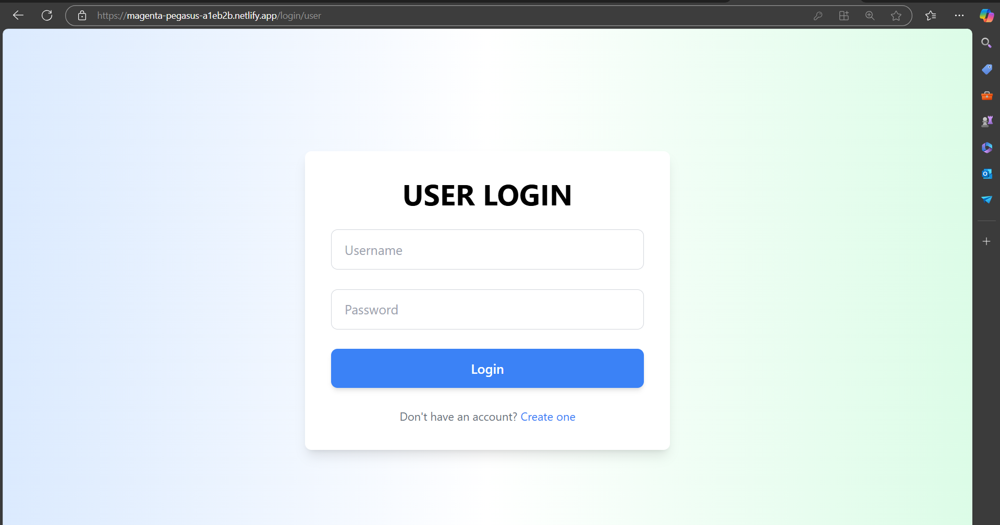
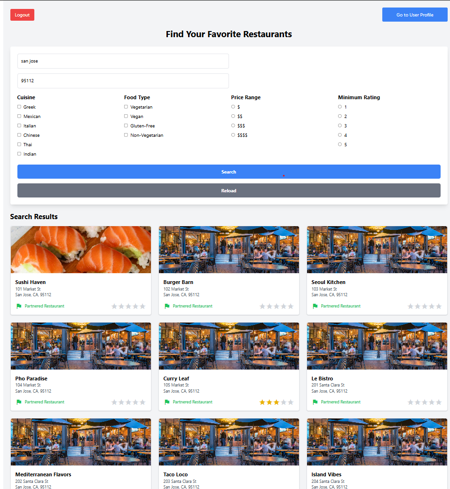
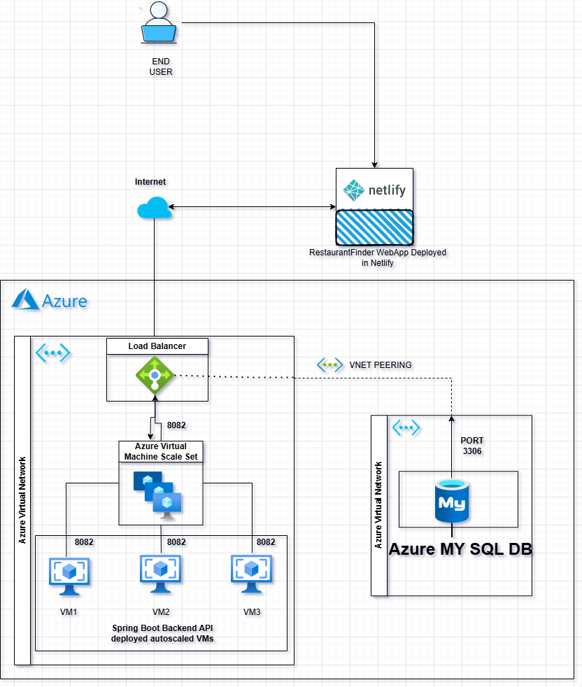

# Restaurant Finder Application

The **Restaurant Finder Application** helps users discover restaurants near their location, providing essential details such as reviews, ratings, and directions using **Google Maps API**. This application leverages modern technologies and a scalable cloud infrastructure for a seamless user experience.

---

## Application Overview

### Features:
- **Search Restaurants**: Find restaurants based on location, cuisine, or name.
- **View Details**: Access restaurant menus, ratings, reviews, and operating hours.
- **Map Integration**: Integrated with **Google Maps API** to display restaurant locations and provide directions.
- **Responsive Design**: Optimized for mobile, tablet, and desktop devices.

### Technology Stack:
- **Frontend**: React.js
- **Backend**: Spring Boot
- **Database**: MySQL
- **Cloud Platform**: Microsoft Azure
- **Third-Party APIs**: Google Maps API

### Deployment Details:
- **Frontend**: Deployed on Netlify
- **Backend API** and **Database**:
  - Hosted on **Azure Virtual Machine Scale Sets (VMSS)** with an **Azure Load Balancer with automatic scale set**.
  - Database managed using **Azure MySQL**.

---

## Access the Application:
Visit the live application here: [Restaurant Finder Application](https://magenta-pegasus-a1eb2b.netlify.app/)

**ScreenShots**

---

## XP Core Values

### 1. **Communication** - *Poorna Priyan Boopathy*
- Initiated daily Zoom meetings to align on current tasks and immediate next steps.
- Collaborated with the team to brainstorm and finalize requirements, leading to innovative solutions.
- Set up and shared a private repository for team accessibility and streamlined collaboration.

### 2. **Respect** - *Deepak Kumar*
- Encouraged and appreciated every team member's contributions, fostering a positive work environment.
- Ensured everyone’s efforts were respected and acknowledged, even during challenges.
- Maintained high team morale and supported a collaborative atmosphere throughout the project.

### 3. **Courage** - *Ravindranath*
- Promoted transparency by ensuring no false or exaggerated claims about project progress.
- Took ownership of challenges and faced them as a team.
- Fostered a sense of trust and reliability through honest communication.

---

## Sprint Tracker

The sprint tracker documents all tasks, timelines, and progress milestones to ensure accountability and efficiency.

- **Access the Sprint Tracker here:** [Sprint Tracker](https://docs.google.com/spreadsheets/d/1yGV6KmbejdPMZ6hqC79hm8klUCUaC9J6D4oZl1cokn8/edit?gid=2010147894#gid=2010147894)

---

## Deployment Architecture

1. **Frontend**:
   - Developed using **React.js**.
   - Integrated with **Google Maps API** for location-based services.
   - Deployed on **Netlify** for responsive and reliable performance.

2. **Backend**:
   - Built with **Spring Boot** for API development.
   - Hosted on **Azure Virtual Machine Scale Sets (VMSS)** behind an **Azure Load Balancer** to ensure scalability and fault tolerance.

3. **Database**:
   - Managed using **Azure MySQL** for secure and efficient data storage.

**OVERALL CLOUD DEPLOPYMENT DIAGRAM**

---

## Google Maps API Integration

We use **Google Maps API** for:
- Displaying restaurant locations on an interactive map.
- Providing real-time directions to selected restaurants.
- Enhancing user experience with geolocation-based search.
